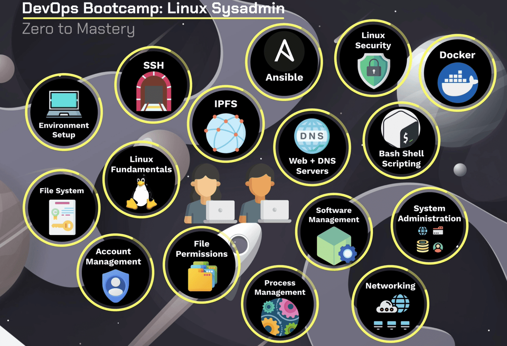

# <p style="text-align: center;">Bootcamp learn linux</p>

# Table of Contents

- [Bootcamp learn linux](#bootcamp-learn-linux)
- [Table of Contents](#table-of-contents)
- [Course Outline](#course-outline)
- [Setting Up the Environment](#setting-up-the-environment)
  - [Linux Distributions](#linux-distributions)
- [The Linux Terminal in Depth](#the-linux-terminal-in-depth)
  - [Getting Help, Man Pages (man, type, help, apropos)](#getting-help-man-pages-man-type-help-apropos)
  - [Linux Command Structure](#linux-command-structure)
  - [Terminal - Keyboard Shortcuts](#terminal---keyboard-shortcuts)
    - [Navigation Shortcuts:](#navigation-shortcuts)
    - [Text Manipulation Shortcuts:](#text-manipulation-shortcuts)
    - [Command History Shortcuts:](#command-history-shortcuts)
    - [Terminal Multiplexer (tmux) Shortcuts (if tmux is installed):](#terminal-multiplexer-tmux-shortcuts-if-tmux-is-installed)
    - [Copy-Paste Shortcuts (when using a terminal emulator that supports them):](#copy-paste-shortcuts-when-using-a-terminal-emulator-that-supports-them)
  - [Mastering the Terminal - the Bash History](#mastering-the-terminal---the-bash-history)
    - [Commands for Interacting with the History:](#commands-for-interacting-with-the-history)
    - [Customizing the History:](#customizing-the-history)
    - [Tips and Tricks:](#tips-and-tricks)
  - [Mastering the Terminal - The TAB Key](#mastering-the-terminal---the-tab-key)
    - [1. **Auto-Completion:**](#1-auto-completion)
    - [2. **Auto-Completion for Commands:**](#2-auto-completion-for-commands)
    - [3. **Auto-Completion for File and Directory Paths:**](#3-auto-completion-for-file-and-directory-paths)
    - [4. **Auto-Completion for Filenames with Spaces:**](#4-auto-completion-for-filenames-with-spaces)
    - [5. **Listing Available Options:**](#5-listing-available-options)
    - [6. **Auto-Completion for Command Options:**](#6-auto-completion-for-command-options)
    - [7. **Auto-Completion for Variable Names:**](#7-auto-completion-for-variable-names)
    - [8. **Auto-Completion for Environment Variables:**](#8-auto-completion-for-environment-variables)
    - [9. **Command Substitution:**](#9-command-substitution)
    - [10. **File and Directory Listing:**](#10-file-and-directory-listing)
    - [Tips:](#tips)
  - [Recording the Date and Time for Each line in History](#recording-the-date-and-time-for-each-line-in-history)
  - [root vs. non-Privileged Users](#root-vs-non-privileged-users)
  - [Running Commands Without Leaving a Trace](#running-commands-without-leaving-a-trace)
  - [Terminals, Consoles, Shells and Commands](#terminals-consoles-shells-and-commands)

# Course Outline

<p align="center">
  
</p>

# Setting Up the Environment

## Linux Distributions

- Linux distributions, often referred to as "distros," are variations of the Linux operating system that include the Linux kernel, system libraries, system utilities, and application software. 
- Each distribution is a complete package that can be installed on a computer, server, or embedded device. 
- There are hundreds of Linux distributions, each catering to specific needs and preferences. 

# The Linux Terminal in Depth

## Getting Help, Man Pages (man, type, help, apropos)

**man, type, help, and apropos** are all commands used in Unix-like operating systems to help users understand and use other commands.

## Linux Command Structure

- commands are the instructions given to the operating system to perform specific tasks. 
- The typical structure of a Linux command is as follows:

```
command [options] [arguments]
```
## Terminal - Keyboard Shortcuts

### Navigation Shortcuts:

### Text Manipulation Shortcuts:

### Command History Shortcuts:

### Terminal Multiplexer (tmux) Shortcuts (if tmux is installed):

### Copy-Paste Shortcuts (when using a terminal emulator that supports them):

## Mastering the Terminal - the Bash History

- The Bash history is a useful feature in the Bash shell that keeps a record of the commands you've entered during your session. 
- It allows you to review, reuse, and manage your command history efficiently. 

1. **Command History Size:**
   - The number of commands stored in the history can be set using the `HISTSIZE` environment variable. For example:
     ```bash
     export HISTSIZE=1000
     ```

2. **History File:**
   - The history is usually saved to a file called `.bash_history` in the user's home directory.

### Commands for Interacting with the History:

1. **`history` Command:**

2. **`!!` (Double Bang):**

3. **`!n` (History Expansion):**

4. **`!-n` (Relative History):**

5. **`!string` (Search and Execute):**

6. **`Ctrl + R` (Reverse Search):**

7. **`history -c` (Clear History):**

8. **`history -d n` (Delete Entry):**

### Customizing the History:

1. **`HISTCONTROL` Variable:**

2. **`HISTFILE` Variable:**

3. **`HISTTIMEFORMAT` Variable:**

### Tips and Tricks:

1. **Persistent History Across Sessions:**

2. **Ignore Commands from History:**

3. **Execute a Command Without Saving to History:**

## Mastering the Terminal - The TAB Key

The `TAB` key is a powerful tool in the Linux terminal, providing various functionalities to ease command-line usage. Here's an in-depth look at the uses of the `TAB` key in the terminal:

### 1. **Auto-Completion:**
   - One of the primary functions of the `TAB` key is auto-completion. When you start typing a command, file, or directory name and press `TAB`, the terminal will attempt to complete the entry based on the available options.
     ```bash
     ls Do<TAB>
     # Result: ls Documents/
     ```

### 2. **Auto-Completion for Commands:**
   - Pressing `TAB` after typing a partial command will attempt to complete it, helping you avoid typing the full command.
     ```bash
     su<TAB>
     # Result: sudo
     ```

### 3. **Auto-Completion for File and Directory Paths:**
   - Auto-completion works for file and directory paths, making it easier to navigate the filesystem.
     ```bash
     cd /ho<TAB>
     # Result: cd /home/
     ```

### 4. **Auto-Completion for Filenames with Spaces:**
   - If a filename contains spaces, the `TAB` key will automatically escape the spaces, allowing you to continue typing.
     ```bash
     cat My\ Docu<TAB>
     # Result: cat My\ Documents/
     ```

### 5. **Listing Available Options:**
   - Pressing `TAB` twice after a partial entry will display a list of available options, helping you choose from the available matches.
     ```bash
     ls D<TAB><TAB>
     # Result: Display list of options starting with D
     ```

### 6. **Auto-Completion for Command Options:**
   - When typing command options, pressing `TAB` will auto-complete the option if there is a unique match.
     ```bash
     ls -l --h<TAB>
     # Result: ls -l --help
     ```

### 7. **Auto-Completion for Variable Names:**
   - In some shells, pressing `TAB` can auto-complete variable names.
     ```bash
     $MY_VA<TAB>
     # Result: $MY_VARIABLE
     ```

### 8. **Auto-Completion for Environment Variables:**
   - Environment variables can be auto-completed by pressing `TAB` after the `$` symbol.
     ```bash
     echo $HOM<TAB>
     # Result: echo $HOME
     ```

### 9. **Command Substitution:**
   - When using command substitution with `$(...)`, pressing `TAB` can auto-complete the command within the substitution.
     ```bash
     ls -l $(echo /u<TAB>)
     # Result: ls -l $(echo /usr/)
     ```

### 10. **File and Directory Listing:**
   - Pressing `TAB` after a command that expects a file or directory as an argument will list available options.
     ```bash
     cat /etc/p<TAB>
     # Result: cat /etc/passwd
     ```

### Tips:
- **Double-Tap TAB:**
  - Double-tapping `TAB` will show a list of available options if there are multiple matches.
  
- **Cycle Through Options:**
  - If there are multiple matches, pressing `TAB` multiple times will cycle through the available options.

- **Case Sensitivity:**
  - `TAB` key completion is case-sensitive. Be aware of the case when using it.

- **Customization:**
  - The behavior of `TAB` completion can be customized using shell options and configuration files, such as `.bashrc` or `.bash_profile`.

## Recording the Date and Time for Each line in History
## root vs. non-Privileged Users
## Running Commands Without Leaving a Trace
## Terminals, Consoles, Shells and Commands
